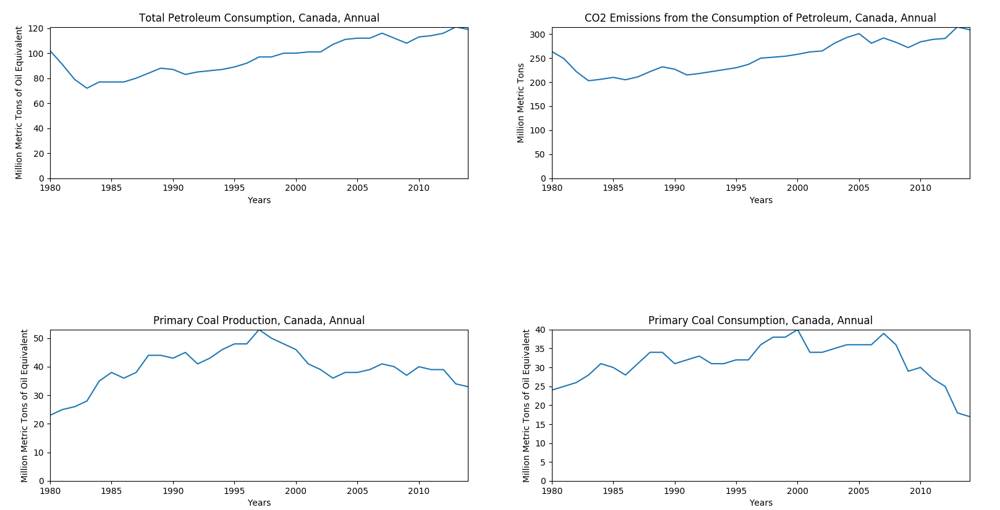

# EIA Data Grapher
Downloads data from the Energy Information Adminstration and graphs it.

## Prerequistes
* [EIA API Key](https://www.eia.gov/opendata/register.php)
* Requests
* Matplotlib
* Numpy

You can install all the modules using pip!
```
pip3 install requests matplotlib numpy
```

## Download
Download the latest version [here](https://github.com/katzrkool/eiaDataGrapher/releases)

## Usage
Grab some urls from [here](https://www.eia.gov/opendata/qb.php)

Put the urls in a text file called urls.txt

Run scraper.py

The first time you run the program, it'll ask you for an API key. Just paste it in and it'll remember it.

The graphs will download and a list of numbered headers will appear. Type up to 10 numbers/data sets to graph. Enjoy!

## Example

